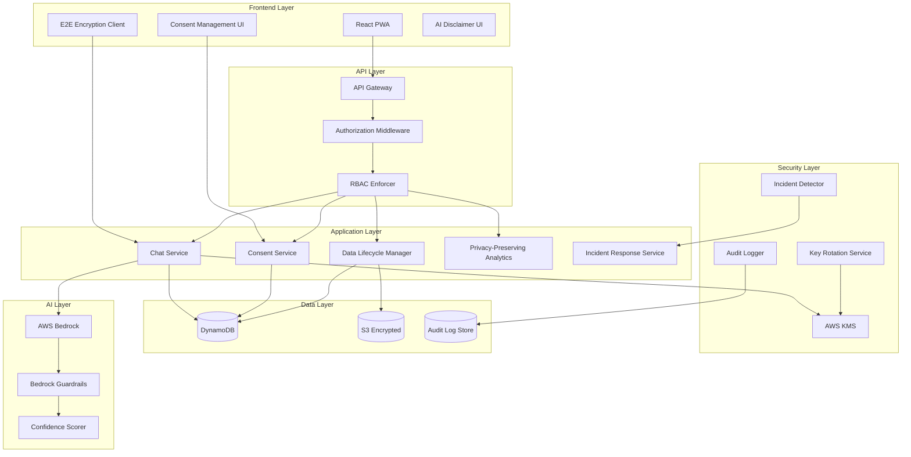

# Design Document: Privacy, Security, and Ethical Safeguards

## Overview

This design document specifies the technical implementation of comprehensive privacy, security, and ethical safeguards for the DoorStepDoctor healthcare platform. The system will implement end-to-end encryption for patient communications, enhanced role-based access control, DPDP Act compliance mechanisms, patient consent management, AI safety disclaimers, comprehensive audit logging, automated data lifecycle management, secure key management, privacy-preserving analytics, and incident response workflows.

The implementation builds upon existing security infrastructure (AWS Bedrock Guardrails, Cognito authentication, encryption at rest/transit, IAM policies) and adds critical privacy and ethical safeguards required for handling sensitive medical data in rural Indian healthcare contexts.

## Architecture

### High-Level Architecture



### Component Interaction Flow

**End-to-End Encrypted Chat Flow:**
1. Patient/ASHA initiates chat → Frontend generates session key pair
2. Public key exchanged via backend → Backend stores public keys only
3. Message encrypted with recipient's public key → Encrypted payload sent to backend
4. Backend stores encrypted message → Recipient fetches and decrypts with private key

**RBAC Authorization Flow:**
1. User makes API request → API Gateway validates JWT token
2. Authorization middleware extracts user role and permissions → RBAC Enforcer checks resource access
3. If authorized → Request proceeds to service layer
4. If unauthorized → Request denied and audit log created

**Consent Validation Flow:**
1. Service attempts to process medical data → Consent Service checks for valid consent record
2. If valid consent exists → Processing continues
3. If no consent or expired → Processing blocked and user prompted for consent

## Components and Interfaces

### 1. End-to-End Encryption Module

**Purpose:** Provides client-side encryption for chat messages ensuring only authorized recipients can decrypt content.

**Key Components:**

- **CryptoClient (Frontend):**
  - Generates RSA-2048 key pairs for each user session
  - Encrypts messages using AES-256-GCM with recipient's public key
  - Decrypts received messages using user's private key
  - Manages secure key storage in browser's IndexedDB with Web Crypto API

- **KeyExchangeService (Backend):**
  - Facilitates secure public key exchange between chat participants
  - Stores only public keys in DynamoDB (never private keys)
  - Validates key authenticity using digital signatures
  - Implements key revocation mechanism for compromised devices

**Interfaces:**

```typescript
// Frontend CryptoClient
interface CryptoClient {
  generateKeyPair(): Promise<CryptoKeyPair>;
  encryptMessage(message: string, recipientPublicKey: string): Promise<EncryptedPayload>;
  decryptMessage(encryptedPayload: EncryptedPayload, privateKey: CryptoKey): Promise<string>;
  exportPublicKey(publicKey: CryptoKey): Promise<string>;
  importPublicKey(publicKeyString: string): Promise<CryptoKey>;
}

interface EncryptedPayload {
  encryptedData: string;  // Base64 encoded
  iv: string;             // Initialization vector
  algorithm: string;      // "AES-256-GCM"
  keyVersion: number;
}

// Backend KeyExchangeService
interface KeyExchangeService {
  storePublicKey(userId: string, publicKey: string): Promise<void>;
  getPublicKey(userId: string): Promise<string>;
  revokeKey(userId: string, keyId: string): Promise<void>;
  validateKeySignature(publicKey: string, signature: string): Promise<boolean>;
}
```

### 2. Enhanced RBAC System

**Purpose:** Enforces granular role-based access control with least-privilege principle.

**Key Components:**

- **RBACMiddleware (API Gateway):**
  - Intercepts all API requests
  - Extracts user identity and role from JWT token
  - Validates permissions before forwarding to Lambda functions
  - Implements permission caching for performance

- **PermissionEngine (Backend):**
  - Defines role-permission mappings
  - Evaluates resource-level access (e.g., ASHA can only access assigned patients)
  - Supports dynamic permission evaluation based on context
  - Logs all authorization decisions to audit log

**Role Definitions:**

```typescript
enum Role {
  PATIENT = "PATIENT",
  ASHA_WORKER = "ASHA_WORKER",
  PHC_DOCTOR = "PHC_DOCTOR",
  ADMINISTRATOR = "ADMINISTRATOR"
}

enum Permission {
  // Patient data permissions
  READ_OWN_DATA = "patient:read:own",
  READ_ASSIGNED_PATIENTS = "patient:read:assigned",
  READ_PHC_PATIENTS = "patient:read:phc",
  READ_ALL_PATIENTS = "patient:read:all",
  
  // Chat permissions
  SEND_MESSAGE = "chat:send",
  READ_ASSIGNED_CHATS = "chat:read:assigned",
  READ_PHC_CHATS = "chat:read:phc",
  
  // AI permissions
  REQUEST_AI_TRIAGE = "ai:triage:request",
  VIEW_AI_CONFIDENCE = "ai:confidence:view",
  
  // Admin permissions
  MANAGE_USERS = "admin:users:manage",
  VIEW_AUDIT_LOGS = "admin:audit:view",
  MANAGE_CONSENT = "admin:consent:manage",
  
  // Analytics permissions
  VIEW_ANALYTICS = "analytics:view",
  EXPORT_ANALYTICS = "analytics:export"
}

interface RolePermissionMap {
  [Role.PATIENT]: Permission[];
  [Role.ASHA_WORKER]: Permission[];
  [Role.PHC_DOCTOR]: Permission[];
  [Role.ADMINISTRATOR]: Permission[];
}
```

**Interfaces:**

```typescript
interface RBACMiddleware {
  authorize(
    userId: string,
    role: Role,
    permission: Permission,
    resourceId?: string
  ): Promise<AuthorizationResult>;
}

interface AuthorizationResult {
  allowed: boolean;
  reason?: string;
  auditLogId: string;
}

interface PermissionEngine {
  hasPermission(role: Role, permission: Permission): boolean;
  canAccessResource(
    userId: string,
    role: Role,
    resourceType: string,
    resourceId: string
  ): Promise<boolean>;
  getEffectivePermissions(role: Role): Permission[];
}
```

### 3. Consent Management System

**Purpose:** Manages patient consent for data collection, AI processing, and data sharing in compliance with DPDP Act.

**Key Components:**

- **ConsentUI (Frontend):**
  - Displays clear, understandable consent forms
  - Supports granular consent options (data collection, AI processing, sharing, research)
  - Shows current consent status and history
  - Allows consent withdrawal with immediate effect

- **ConsentService (Backend):**
  - Stores consent records with timestamps and purposes
  - Validates consent before any data processing operation
  - Handles consent withdrawal and cascading effects
  - Supports guardian consent for minors with additional verification

**Interfaces:**

```typescript
interface ConsentRecord {
  consentId: string;
  patientId: string;
  purposes: ConsentPurpose[];
  grantedAt: string;  // ISO 8601 timestamp
  expiresAt?: string;
  withdrawnAt?: string;
  guardianId?: string;  // For minors
  version: number;  // Consent form version
}

enum ConsentPurpose {
  DATA_COLLECTION = "data_collection",
  AI_PROCESSING = "ai_processing",
  PHC_SHARING = "phc_sharing",
  RESEARCH = "research"
}

interface ConsentService {
  grantConsent(
    patientId: string,
    purposes: ConsentPurpose[],
    guardianId?: string
  ): Promise<ConsentRecord>;
  
  withdrawConsent(
    patientId: string,
    purposes: ConsentPurpose[]
  ): Promise<void>;
  
  validateConsent(
    patientId: string,
    purpose: ConsentPurpose
  ): Promise<boolean>;
  
  getConsentHistory(patientId: string): Promise<ConsentRecord[]>;
}
```

### 4. AI Safety and Disclaimer System

**Purpose:** Ensures safe AI usage with clear disclaimers, confidence scores, and human oversight triggers.

**Key Components:**

- **DisclaimerUI (Frontend):**
  - Displays persistent AI disclaimer banner
  - Shows confidence scores with color-coded indicators
  - Highlights low-confidence recommendations requiring doctor review
  - Requires ASHA acknowledgment before viewing AI recommendations

- **ConfidenceScorer (Backend):**
  - Calculates confidence scores from Bedrock model outputs
  - Applies thresholds for automatic escalation (< 70%)
  - Detects critical symptoms requiring immediate doctor review
  - Logs all confidence scores to audit log

**Interfaces:**

```typescript
interface AIRecommendation {
  recommendationId: string;
  content: string;
  confidenceScore: number;  // 0-100
  requiresDoctorReview: boolean;
  criticalSymptoms: string[];
  disclaimer: string;
  generatedAt: string;
  modelVersion: string;
}

interface ConfidenceScorer {
  calculateConfidence(
    modelOutput: BedrockResponse,
    inputContext: TriageContext
  ): Promise<number>;
  
  shouldEscalate(
    confidenceScore: number,
    symptoms: string[]
  ): boolean;
  
  detectCriticalSymptoms(symptoms: string[]): string[];
}

interface DisclaimerService {
  getDisclaimerText(language: string): string;
  requireAcknowledgment(userId: string, recommendationId: string): Promise<void>;
  hasAcknowledged(userId: string, recommendationId: string): Promise<boolean>;
}
```

### 5. Audit Logging System

**Purpose:** Provides comprehensive, tamper-evident audit trails for compliance and security monitoring.

**Key Components:**

- **AuditLogger (Backend):**
  - Logs all data access events with user, timestamp, and purpose
  - Logs authentication attempts and authorization decisions
  - Logs consent changes and AI model invocations
  - Stores logs in immutable, append-only storage

- **AuditAnalyzer (Backend):**
  - Detects suspicious access patterns
  - Generates real-time alerts for security incidents
  - Provides audit trail queries for compliance officers
  - Supports audit log export for external analysis

**Interfaces:**

```typescript
interface AuditLogEntry {
  logId: string;
  timestamp: string;  // ISO 8601
  eventType: AuditEventType;
  userId: string;
  userRole: Role;
  action: string;
  resourceType: string;
  resourceId: string;
  result: "success" | "failure";
  reason?: string;
  ipAddress: string;
  metadata: Record<string, any>;
}

enum AuditEventType {
  DATA_ACCESS = "data_access",
  AUTHENTICATION = "authentication",
  AUTHORIZATION = "authorization",
  CONSENT_CHANGE = "consent_change",
  AI_INVOCATION = "ai_invocation",
  ENCRYPTION_FAILURE = "encryption_failure",
  KEY_ROTATION = "key_rotation",
  DATA_DELETION = "data_deletion"
}

interface AuditLogger {
  log(entry: Omit<AuditLogEntry, "logId" | "timestamp">): Promise<void>;
  query(filters: AuditQueryFilters): Promise<AuditLogEntry[]>;
  detectAnomalies(): Promise<AnomalyAlert[]>;
}

interface AuditQueryFilters {
  userId?: string;
  eventType?: AuditEventType;
  startDate?: string;
  endDate?: string;
  resourceId?: string;
}
```

### 6. Data Lifecycle Management System

**Purpose:** Automates data retention, archival, anonymization, and deletion according to policy and legal requirements.

**Key Components:**

- **LifecycleManager (Backend):**
  - Classifies data by age: active (0-3 years), archived (3-7 years), anonymized (7+ years)
  - Runs daily jobs to move data between lifecycle stages
  - Implements soft deletion with 90-day retention
  - Handles data deletion requests within 30 days

- **AnonymizationEngine (Backend):**
  - Removes personally identifiable information
  - Preserves clinical value for research and analytics
  - Applies k-anonymity (k=5) to prevent re-identification
  - Generates audit logs for all anonymization operations

**Interfaces:**

```typescript
enum DataLifecycleStage {
  ACTIVE = "active",           // 0-3 years
  ARCHIVED = "archived",       // 3-7 years
  ANONYMIZED = "anonymized",   // 7+ years
  SOFT_DELETED = "soft_deleted" // Pending permanent deletion
}

interface MedicalDataRecord {
  recordId: string;
  patientId: string;
  data: any;
  createdAt: string;
  lifecycleStage: DataLifecycleStage;
  anonymizedAt?: string;
  deletedAt?: string;
}

interface LifecycleManager {
  classifyData(recordId: string): Promise<DataLifecycleStage>;
  archiveOldData(): Promise<number>;  // Returns count of archived records
  anonymizeArchivedData(): Promise<number>;
  processDeleteRequests(): Promise<number>;
  softDelete(recordId: string): Promise<void>;
  permanentDelete(recordId: string): Promise<void>;
}

interface AnonymizationEngine {
  anonymize(record: MedicalDataRecord): Promise<AnonymizedRecord>;
  validateAnonymization(record: AnonymizedRecord): Promise<boolean>;
  applyKAnonymity(records: MedicalDataRecord[], k: number): Promise<AnonymizedRecord[]>;
}

interface AnonymizedRecord {
  recordId: string;
  ageRange: string;  // e.g., "25-30"
  genderCategory: string;
  regionCode: string;
  symptoms: string[];
  diagnosis: string;
  outcome: string;
  timestamp: string;  // Rounded to month
}
```

### 7. Key Management and Rotation System

**Purpose:** Securely manages encryption keys with automatic rotation and version control.

**Key Components:**

- **KeyManager (Backend):**
  - Integrates with AWS KMS for customer-managed keys
  - Implements automatic 90-day key rotation
  - Maintains key version history for decrypting historical data
  - Provides key revocation for compromised devices

- **KeyRotationService (Backend):**
  - Schedules and executes key rotation operations
  - Re-encrypts data with new keys without service interruption
  - Implements exponential backoff retry for failed rotations
  - Alerts administrators on rotation failures

**Interfaces:**

```typescript
interface KeyManager {
  generateKey(keyType: KeyType): Promise<string>;  // Returns key ID
  getKey(keyId: string): Promise<CryptoKey>;
  rotateKey(keyId: string): Promise<string>;  // Returns new key ID
  revokeKey(keyId: string): Promise<void>;
  listKeyVersions(keyId: string): Promise<KeyVersion[]>;
}

enum KeyType {
  DATA_ENCRYPTION = "data_encryption",
  CHAT_ENCRYPTION = "chat_encryption",
  AUDIT_LOG_ENCRYPTION = "audit_log_encryption"
}

interface KeyVersion {
  keyId: string;
  version: number;
  createdAt: string;
  rotatedAt?: string;
  status: "active" | "rotated" | "revoked";
}

interface KeyRotationService {
  scheduleRotation(keyId: string, intervalDays: number): Promise<void>;
  executeRotation(keyId: string): Promise<RotationResult>;
  reEncryptData(oldKeyId: string, newKeyId: string): Promise<number>;
}

interface RotationResult {
  success: boolean;
  newKeyId?: string;
  recordsReEncrypted: number;
  errors?: string[];
}
```

### 8. Privacy-Preserving Analytics System

**Purpose:** Enables health trend analysis without exposing individual patient identities.

**Key Components:**

- **AnalyticsEngine (Backend):**
  - Generates aggregate statistics from anonymized data
  - Applies k-anonymity (k=5) to prevent re-identification
  - Implements differential privacy for statistical queries
  - Suppresses results with fewer than 5 patients

- **AnalyticsUI (Frontend):**
  - Displays aggregate health trends and statistics
  - Supports filtering by region, time period, and symptom category
  - Shows data quality indicators and privacy guarantees
  - Requires administrator approval for data export

**Interfaces:**

```typescript
interface AnalyticsQuery {
  queryId: string;
  filters: AnalyticsFilters;
  metrics: AnalyticsMetric[];
  privacyParams: PrivacyParams;
}

interface AnalyticsFilters {
  regionCode?: string;
  startDate: string;
  endDate: string;
  symptomCategories?: string[];
  ageRange?: string;
}

enum AnalyticsMetric {
  PATIENT_COUNT = "patient_count",
  SYMPTOM_FREQUENCY = "symptom_frequency",
  DIAGNOSIS_DISTRIBUTION = "diagnosis_distribution",
  OUTCOME_RATES = "outcome_rates"
}

interface PrivacyParams {
  kAnonymity: number;  // Default: 5
  epsilon?: number;    // Differential privacy parameter
  suppressThreshold: number;  // Default: 5
}

interface AnalyticsResult {
  queryId: string;
  data: AggregateStatistic[];
  privacyGuarantees: string;
  recordCount: number;
  suppressed: boolean;
}

interface AggregateStatistic {
  category: string;
  value: number;
  confidenceInterval?: [number, number];
}

interface AnalyticsEngine {
  executeQuery(query: AnalyticsQuery): Promise<AnalyticsResult>;
  validatePrivacy(result: AnalyticsResult): Promise<boolean>;
  exportData(queryId: string, approverId: string): Promise<string>;  // Returns S3 URL
}
```

### 9. Incident Response System

**Purpose:** Automates incident detection, classification, and response workflows for security events.

**Key Components:**

- **IncidentDetector (Backend):**
  - Monitors audit logs for suspicious patterns
  - Classifies incidents by severity (low, medium, high, critical)
  - Generates real-time alerts for high/critical incidents
  - Tracks incident response timelines

- **IncidentResponseService (Backend):**
  - Provides incident response workflows
  - Generates lists of affected patients for breach notification
  - Tracks 72-hour breach notification deadline
  - Creates post-incident reports

**Interfaces:**

```typescript
interface SecurityIncident {
  incidentId: string;
  detectedAt: string;
  severity: IncidentSeverity;
  type: IncidentType;
  description: string;
  affectedUsers: string[];
  affectedData: string[];
  status: IncidentStatus;
  assignedTo?: string;
  resolvedAt?: string;
}

enum IncidentSeverity {
  LOW = "low",
  MEDIUM = "medium",
  HIGH = "high",
  CRITICAL = "critical"
}

enum IncidentType {
  UNAUTHORIZED_ACCESS = "unauthorized_access",
  DATA_BREACH = "data_breach",
  ENCRYPTION_FAILURE = "encryption_failure",
  SUSPICIOUS_PATTERN = "suspicious_pattern",
  CONSENT_VIOLATION = "consent_violation"
}

enum IncidentStatus {
  DETECTED = "detected",
  INVESTIGATING = "investigating",
  CONTAINED = "contained",
  RESOLVED = "resolved"
}

interface IncidentDetector {
  detectIncidents(): Promise<SecurityIncident[]>;
  classifyIncident(incident: SecurityIncident): IncidentSeverity;
  alertTeam(incident: SecurityIncident): Promise<void>;
}

interface IncidentResponseService {
  createIncident(incident: Omit<SecurityIncident, "incidentId">): Promise<string>;
  updateIncidentStatus(incidentId: string, status: IncidentStatus): Promise<void>;
  getAffectedPatients(incidentId: string): Promise<string[]>;
  generateBreachNotification(incidentId: string): Promise<BreachNotification>;
  createPostIncidentReport(incidentId: string): Promise<IncidentReport>;
}

interface BreachNotification {
  incidentId: string;
  affectedPatients: string[];
  dataTypes: string[];
  notificationDeadline: string;  // 72 hours from detection
  notificationText: string;
}

interface IncidentReport {
  incidentId: string;
  summary: string;
  rootCause: string;
  remediationActions: string[];
  preventiveMeasures: string[];
  timeline: IncidentTimelineEvent[];
}

interface IncidentTimelineEvent {
  timestamp: string;
  event: string;
  actor: string;
}
```

## Data Models

### DynamoDB Tables

**1. EncryptedMessages Table:**
```typescript
interface EncryptedMessageItem {
  PK: string;  // "CHAT#{chatId}"
  SK: string;  // "MSG#{timestamp}#{messageId}"
  messageId: string;
  senderId: string;
  recipientId: string;
  encryptedContent: string;  // Base64 encoded
  iv: string;
  algorithm: string;
  keyVersion: number;
  createdAt: string;
  TTL?: number;  // Optional expiration
}
```

**2. ConsentRecords Table:**
```typescript
interface ConsentRecordItem {
  PK: string;  // "PATIENT#{patientId}"
  SK: string;  // "CONSENT#{consentId}"
  consentId: string;
  patientId: string;
  purposes: ConsentPurpose[];
  grantedAt: string;
  expiresAt?: string;
  withdrawnAt?: string;
  guardianId?: string;
  version: number;
  GSI1PK: string;  // "CONSENT#{purpose}" for querying by purpose
  GSI1SK: string;  // "PATIENT#{patientId}"
}
```

**3. AuditLogs Table:**
```typescript
interface AuditLogItem {
  PK: string;  // "AUDIT#{date}"
  SK: string;  // "LOG#{timestamp}#{logId}"
  logId: string;
  timestamp: string;
  eventType: AuditEventType;
  userId: string;
  userRole: Role;
  action: string;
  resourceType: string;
  resourceId: string;
  result: "success" | "failure";
  reason?: string;
  ipAddress: string;
  metadata: Record<string, any>;
  GSI1PK: string;  // "USER#{userId}" for querying by user
  GSI1SK: string;  // "AUDIT#{timestamp}"
}
```

**4. PublicKeys Table:**
```typescript
interface PublicKeyItem {
  PK: string;  // "USER#{userId}"
  SK: string;  // "KEY#{keyId}"
  keyId: string;
  userId: string;
  publicKey: string;  // PEM format
  algorithm: string;
  createdAt: string;
  revokedAt?: string;
  deviceId: string;
}
```

**5. SecurityIncidents Table:**
```typescript
interface SecurityIncidentItem {
  PK: string;  // "INCIDENT#{incidentId}"
  SK: string;  // "METADATA"
  incidentId: string;
  detectedAt: string;
  severity: IncidentSeverity;
  type: IncidentType;
  description: string;
  affectedUsers: string[];
  affectedData: string[];
  status: IncidentStatus;
  assignedTo?: string;
  resolvedAt?: string;
  GSI1PK: string;  // "STATUS#{status}" for querying by status
  GSI1SK: string;  // "INCIDENT#{detectedAt}"
}
```

**6. DataLifecycle Table:**
```typescript
interface DataLifecycleItem {
  PK: string;  // "RECORD#{recordId}"
  SK: string;  // "LIFECYCLE"
  recordId: string;
  patientId: string;
  dataType: string;
  createdAt: string;
  lifecycleStage: DataLifecycleStage;
  nextTransitionDate: string;
  anonymizedAt?: string;
  deletedAt?: string;
  GSI1PK: string;  // "STAGE#{lifecycleStage}"
  GSI1SK: string;  // "TRANSITION#{nextTransitionDate}"
}
```

### S3 Bucket Structure

**Encrypted Medical Records Bucket:**
```
s3://doorstepdoctor-medical-records-{region}/
  ├── active/
  │   └── {patientId}/
  │       └── {recordId}.encrypted
  ├── archived/
  │   └── {year}/
  │       └── {patientId}/
  │           └── {recordId}.encrypted
  └── anonymized/
      └── {year}/
          └── {month}/
              └── aggregate-{timestamp}.json
```

**Audit Logs Bucket (Immutable):**
```
s3://doorstepdoctor-audit-logs-{region}/
  └── {year}/
      └── {month}/
          └── {day}/
              └── audit-{timestamp}.json.gz
```

## 