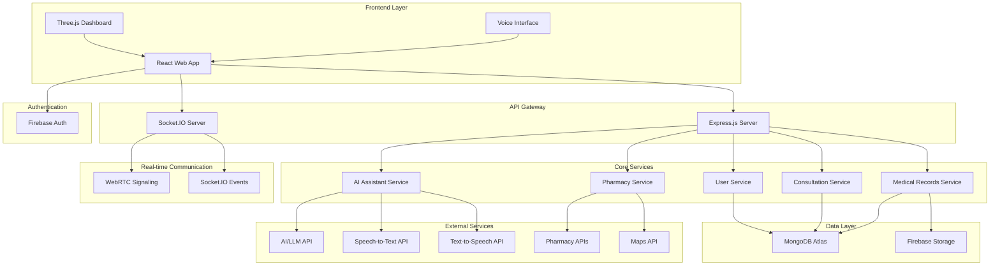
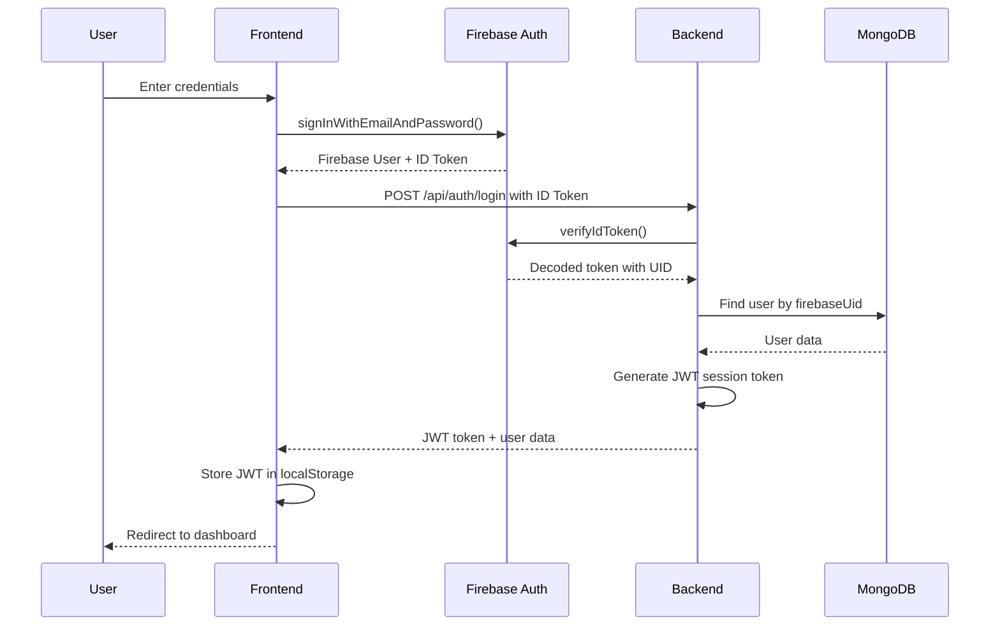
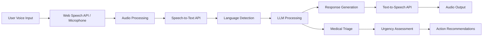

# DoorStepDoctor – Rural Healthcare Access Platform
## Design Document

## Overview

DoorStepDoctor is a full-stack healthcare platform designed to bridge the healthcare access gap in rural India. The system leverages modern web technologies, AI-powered assistance, and low-bandwidth optimization to provide accessible medical consultations, voice-first interactions, and pharmacy integration.

The platform follows a microservices-inspired architecture with clear separation between frontend (React), backend (Node.js/Express), real-time communication (Socket.IO/WebRTC), and external integrations (Firebase Auth, AI services, pharmacy APIs).

## Architecture

### High-Level System Architecture



### Technology Stack

**Frontend:**
- React 18 with TypeScript
- Three.js for 3D health dashboard
- Socket.IO Client for real-time communication
- WebRTC for video/audio calls
- Web Speech API for voice interaction
- Tailwind CSS for responsive design
- React Router for navigation
- Axios for API communication

**Backend:**
- Node.js with Express.js
- TypeScript for type safety
- Socket.IO for real-time events
- WebRTC signaling server
- JWT for session management
- Multer for file uploads
- Compression middleware for low-bandwidth optimization

**Database:**
- MongoDB Atlas for primary data storage
- Firebase Storage for file storage (images, documents)
- Redis for session management and caching

**Authentication:**
- Firebase Authentication
- Custom role-based access control
- OTP verification for phone numbers

**External Integrations:**
- OpenAI/Anthropic API for AI medical assistant
- Google Speech-to-Text API
- Google Text-to-Speech API
- Google Maps API for pharmacy locations
- Mock pharmacy APIs for medicine availability

## Components and Interfaces

### Frontend Component Architecture

```
src/
├── components/
│   ├── auth/
│   │   ├── LoginForm.tsx
│   │   ├── RegisterForm.tsx
│   │   └── OTPVerification.tsx
│   ├── dashboard/
│   │   ├── PatientDashboard.tsx
│   │   ├── DoctorDashboard.tsx
│   │   └── ThreeJSHealthDashboard.tsx
│   ├── consultation/
│   │   ├── ConsultationRoom.tsx
│   │   ├── VideoCall.tsx
│   │   ├── ChatInterface.tsx
│   │   └── ConsultationHistory.tsx
│   ├── medical-records/
│   │   ├── MedicalProfile.tsx
│   │   ├── FileUpload.tsx
│   │   └── PrescriptionViewer.tsx
│   ├── ai-assistant/
│   │   ├── VoiceInterface.tsx
│   │   ├── ChatBot.tsx
│   │   └── LanguageSelector.tsx
│   ├── pharmacy/
│   │   ├── PharmacyFinder.tsx
│   │   ├── MedicineSearch.tsx
│   │   └── OrderTracking.tsx
│   ├── common/
│   │   ├── Header.tsx
│   │   ├── Navigation.tsx
│   │   ├── LoadingSpinner.tsx
│   │   └── ErrorBoundary.tsx
│   └── low-bandwidth/
│       ├── LowBandwidthDetector.tsx
│       └── OptimizedComponents.tsx
├── hooks/
│   ├── useAuth.ts
│   ├── useSocket.ts
│   ├── useWebRTC.ts
│   ├── useVoice.ts
│   └── useBandwidth.ts
├── services/
│   ├── api.ts
│   ├── socket.ts
│   ├── webrtc.ts
│   ├── voice.ts
│   └── storage.ts
├── types/
│   ├── user.ts
│   ├── consultation.ts
│   ├── medical.ts
│   └── pharmacy.ts
└── utils/
    ├── constants.ts
    ├── helpers.ts
    └── validation.ts
```

### Backend API Structure

```
src/
├── controllers/
│   ├── authController.ts
│   ├── userController.ts
│   ├── consultationController.ts
│   ├── medicalRecordsController.ts
│   ├── aiAssistantController.ts
│   └── pharmacyController.ts
├── models/
│   ├── User.ts
│   ├── Consultation.ts
│   ├── MedicalRecord.ts
│   ├── Prescription.ts
│   └── Pharmacy.ts
├── middleware/
│   ├── auth.ts
│   ├── validation.ts
│   ├── rateLimit.ts
│   └── compression.ts
├── routes/
│   ├── auth.ts
│   ├── users.ts
│   ├── consultations.ts
│   ├── medical-records.ts
│   ├── ai-assistant.ts
│   └── pharmacy.ts
├── services/
│   ├── aiService.ts
│   ├── speechService.ts
│   ├── pharmacyService.ts
│   └── notificationService.ts
├── sockets/
│   ├── consultationSocket.ts
│   ├── webrtcSignaling.ts
│   └── aiAssistantSocket.ts
└── utils/
    ├── database.ts
    ├── encryption.ts
    └── logger.ts
```

### Core Interfaces

```typescript
// User Types
interface User {
  id: string;
  email: string;
  phone: string;
  name: string;
  role: 'patient' | 'doctor' | 'admin';
  isVerified: boolean;
  createdAt: Date;
  updatedAt: Date;
}

interface Patient extends User {
  age: number;
  location: {
    latitude: number;
    longitude: number;
    address: string;
  };
  medicalProfile: MedicalProfile;
  languagePreference: string;
  lowBandwidthMode: boolean;
}

interface Doctor extends User {
  medicalLicenseNumber: string;
  specialization: string[];
  location: {
    latitude: number;
    longitude: number;
    address: string;
  };
  availability: {
    isAvailable: boolean;
    workingHours: {
      start: string;
      end: string;
    };
    consultationQueue: string[];
  };
  rating: number;
  consultationsCompleted: number;
}

// Medical Records
interface MedicalProfile {
  patientId: string;
  medicalHistory: string[];
  currentMedications: Medication[];
  allergies: string[];
  documents: MedicalDocument[];
  healthMetrics: HealthMetric[];
  privacySettings: {
    hideFromDoctors: string[];
  };
}

interface MedicalDocument {
  id: string;
  type: 'prescription' | 'report' | 'image';
  fileName: string;
  fileUrl: string;
  uploadDate: Date;
  metadata: {
    reportType?: string;
    doctorName?: string;
    notes?: string;
  };
}

interface HealthMetric {
  id: string;
  type: 'blood_pressure' | 'heart_rate' | 'weight' | 'temperature';
  value: number | { systolic: number; diastolic: number };
  unit: string;
  timestamp: Date;
  source: 'manual' | 'device' | 'doctor';
}

// Consultation
interface Consultation {
  id: string;
  patientId: string;
  doctorId: string;
  status: 'requested' | 'accepted' | 'in_progress' | 'completed' | 'cancelled';
  type: 'chat' | 'voice' | 'video';
  startTime: Date;
  endTime?: Date;
  duration?: number;
  messages: ConsultationMessage[];
  prescription?: Prescription;
  notes: string;
  rating?: {
    patientRating: number;
    doctorRating: number;
    feedback: string;
  };
}

interface ConsultationMessage {
  id: string;
  senderId: string;
  senderRole: 'patient' | 'doctor';
  content: string;
  type: 'text' | 'image' | 'file';
  timestamp: Date;
  isTranslated?: boolean;
  originalLanguage?: string;
}

// AI Assistant
interface AIConversation {
  id: string;
  patientId: string;
  messages: AIMessage[];
  language: string;
  context: {
    medicalHistory: string[];
    currentSymptoms: string[];
    urgencyLevel: 'low' | 'medium' | 'high' | 'emergency';
  };
  createdAt: Date;
  updatedAt: Date;
}

interface AIMessage {
  id: string;
  role: 'user' | 'assistant';
  content: string;
  audioUrl?: string;
  timestamp: Date;
  confidence?: number;
}

// Pharmacy
interface Pharmacy {
  id: string;
  name: string;
  address: string;
  location: {
    latitude: number;
    longitude: number;
  };
  phone: string;
  workingHours: {
    open: string;
    close: string;
  };
  inventory: MedicineInventory[];
  rating: number;
  isVerified: boolean;
}

interface MedicineInventory {
  medicineId: string;
  name: string;
  genericName: string;
  manufacturer: string;
  price: number;
  quantity: number;
  expiryDate: Date;
  isAvailable: boolean;
}

interface MedicineOrder {
  id: string;
  patientId: string;
  pharmacyId: string;
  prescriptionId: string;
  medicines: {
    medicineId: string;
    quantity: number;
    price: number;
  }[];
  totalAmount: number;
  status: 'placed' | 'confirmed' | 'prepared' | 'delivered' | 'cancelled';
  orderDate: Date;
  estimatedDelivery?: Date;
}
```

## Data Models

### MongoDB Schema Design

```javascript
// Users Collection
const userSchema = {
  _id: ObjectId,
  email: String, // indexed, unique
  phone: String, // indexed, unique
  name: String,
  role: String, // enum: ['patient', 'doctor', 'admin']
  isVerified: Boolean,
  firebaseUid: String, // indexed, unique
  
  // Patient-specific fields
  age: Number,
  location: {
    type: "Point",
    coordinates: [Number, Number] // [longitude, latitude]
  },
  languagePreference: String,
  lowBandwidthMode: Boolean,
  
  // Doctor-specific fields
  medicalLicenseNumber: String,
  specialization: [String],
  availability: {
    isAvailable: Boolean,
    workingHours: {
      start: String,
      end: String
    },
    consultationQueue: [ObjectId]
  },
  rating: Number,
  consultationsCompleted: Number,
  
  createdAt: Date,
  updatedAt: Date
};

// Medical Profiles Collection
const medicalProfileSchema = {
  _id: ObjectId,
  patientId: ObjectId, // indexed
  medicalHistory: [String],
  currentMedications: [{
    name: String,
    dosage: String,
    frequency: String,
    startDate: Date,
    endDate: Date
  }],
  allergies: [String],
  documents: [{
    id: String,
    type: String, // enum: ['prescription', 'report', 'image']
    fileName: String,
    fileUrl: String,
    uploadDate: Date,
    metadata: {
      reportType: String,
      doctorName: String,
      notes: String
    }
  }],
  healthMetrics: [{
    type: String,
    value: Schema.Types.Mixed,
    unit: String,
    timestamp: Date,
    source: String
  }],
  privacySettings: {
    hideFromDoctors: [String]
  },
  createdAt: Date,
  updatedAt: Date
};

// Consultations Collection
const consultationSchema = {
  _id: ObjectId,
  patientId: ObjectId, // indexed
  doctorId: ObjectId, // indexed
  status: String, // enum: ['requested', 'accepted', 'in_progress', 'completed', 'cancelled']
  type: String, // enum: ['chat', 'voice', 'video']
  startTime: Date, // indexed
  endTime: Date,
  duration: Number,
  messages: [{
    id: String,
    senderId: ObjectId,
    senderRole: String,
    content: String,
    type: String,
    timestamp: Date,
    isTranslated: Boolean,
    originalLanguage: String
  }],
  prescription: {
    medicines: [{
      name: String,
      genericName: String,
      dosage: String,
      frequency: String,
      duration: String,
      instructions: String
    }],
    notes: String,
    issuedAt: Date
  },
  notes: String,
  rating: {
    patientRating: Number,
    doctorRating: Number,
    feedback: String
  },
  createdAt: Date,
  updatedAt: Date
};

// AI Conversations Collection
const aiConversationSchema = {
  _id: ObjectId,
  patientId: ObjectId, // indexed
  messages: [{
    id: String,
    role: String, // enum: ['user', 'assistant']
    content: String,
    audioUrl: String,
    timestamp: Date,
    confidence: Number
  }],
  language: String,
  context: {
    medicalHistory: [String],
    currentSymptoms: [String],
    urgencyLevel: String // enum: ['low', 'medium', 'high', 'emergency']
  },
  createdAt: Date,
  updatedAt: Date
};

// Pharmacies Collection
const pharmacySchema = {
  _id: ObjectId,
  name: String,
  address: String,
  location: {
    type: "Point",
    coordinates: [Number, Number] // [longitude, latitude]
  },
  phone: String,
  workingHours: {
    open: String,
    close: String
  },
  inventory: [{
    medicineId: String,
    name: String,
    genericName: String,
    manufacturer: String,
    price: Number,
    quantity: Number,
    expiryDate: Date,
    isAvailable: Boolean
  }],
  rating: Number,
  isVerified: Boolean,
  createdAt: Date,
  updatedAt: Date
};

// Medicine Orders Collection
const medicineOrderSchema = {
  _id: ObjectId,
  patientId: ObjectId, // indexed
  pharmacyId: ObjectId, // indexed
  prescriptionId: ObjectId,
  medicines: [{
    medicineId: String,
    quantity: Number,
    price: Number
  }],
  totalAmount: Number,
  status: String, // enum: ['placed', 'confirmed', 'prepared', 'delivered', 'cancelled']
  orderDate: Date, // indexed
  estimatedDelivery: Date,
  createdAt: Date,
  updatedAt: Date
};
```

### Database Indexes

```javascript
// Performance optimization indexes
db.users.createIndex({ "email": 1 }, { unique: true });
db.users.createIndex({ "phone": 1 }, { unique: true });
db.users.createIndex({ "firebaseUid": 1 }, { unique: true });
db.users.createIndex({ "role": 1 });
db.users.createIndex({ "location": "2dsphere" });

db.medicalProfiles.createIndex({ "patientId": 1 }, { unique: true });

db.consultations.createIndex({ "patientId": 1 });
db.consultations.createIndex({ "doctorId": 1 });
db.consultations.createIndex({ "startTime": -1 });
db.consultations.createIndex({ "status": 1 });

db.aiConversations.createIndex({ "patientId": 1 });
db.aiConversations.createIndex({ "createdAt": -1 });

db.pharmacies.createIndex({ "location": "2dsphere" });
db.pharmacies.createIndex({ "isVerified": 1 });

db.medicineOrders.createIndex({ "patientId": 1 });
db.medicineOrders.createIndex({ "pharmacyId": 1 });
db.medicineOrders.createIndex({ "orderDate": -1 });
```
## API Design

### Authentication Endpoints

```typescript
// POST /api/auth/register
interface RegisterRequest {
  email: string;
  phone: string;
  name: string;
  role: 'patient' | 'doctor';
  age?: number; // for patients
  location?: { latitude: number; longitude: number; address: string };
  medicalLicenseNumber?: string; // for doctors
  specialization?: string[]; // for doctors
}

interface RegisterResponse {
  success: boolean;
  user: User;
  token: string;
  message: string;
}

// POST /api/auth/login
interface LoginRequest {
  email: string;
  password: string;
}

interface LoginResponse {
  success: boolean;
  user: User;
  token: string;
  message: string;
}

// POST /api/auth/verify-otp
interface VerifyOTPRequest {
  phone: string;
  otp: string;
}

// POST /api/auth/logout
interface LogoutResponse {
  success: boolean;
  message: string;
}
```

### User Management Endpoints

```typescript
// GET /api/users/profile
interface ProfileResponse {
  success: boolean;
  user: User;
  medicalProfile?: MedicalProfile; // for patients
}

// PUT /api/users/profile
interface UpdateProfileRequest {
  name?: string;
  location?: { latitude: number; longitude: number; address: string };
  languagePreference?: string;
  lowBandwidthMode?: boolean;
  availability?: Doctor['availability']; // for doctors
}

// GET /api/users/doctors/available
interface AvailableDoctorsResponse {
  success: boolean;
  doctors: Doctor[];
  total: number;
}

// GET /api/users/doctors/search
interface SearchDoctorsRequest {
  specialization?: string;
  location?: { latitude: number; longitude: number };
  radius?: number; // in km
}
```

### Medical Records Endpoints

```typescript
// GET /api/medical-records/:patientId
interface MedicalRecordsResponse {
  success: boolean;
  medicalProfile: MedicalProfile;
}

// POST /api/medical-records/upload
interface UploadDocumentRequest {
  file: File;
  type: 'prescription' | 'report' | 'image';
  metadata?: {
    reportType?: string;
    doctorName?: string;
    notes?: string;
  };
}

interface UploadDocumentResponse {
  success: boolean;
  document: MedicalDocument;
  message: string;
}

// PUT /api/medical-records/health-metrics
interface AddHealthMetricRequest {
  type: 'blood_pressure' | 'heart_rate' | 'weight' | 'temperature';
  value: number | { systolic: number; diastolic: number };
  unit: string;
  timestamp: Date;
  source: 'manual' | 'device' | 'doctor';
}

// DELETE /api/medical-records/documents/:documentId
interface DeleteDocumentResponse {
  success: boolean;
  message: string;
}
```

### Consultation Endpoints

```typescript
// POST /api/consultations/request
interface ConsultationRequest {
  doctorId?: string; // optional, system will assign if not provided
  type: 'chat' | 'voice' | 'video';
  urgency: 'low' | 'medium' | 'high' | 'emergency';
  symptoms?: string;
}

interface ConsultationResponse {
  success: boolean;
  consultation: Consultation;
  estimatedWaitTime: number; // in minutes
}

// GET /api/consultations/active
interface ActiveConsultationResponse {
  success: boolean;
  consultation: Consultation | null;
}

// GET /api/consultations/history
interface ConsultationHistoryResponse {
  success: boolean;
  consultations: Consultation[];
  total: number;
  page: number;
  limit: number;
}

// PUT /api/consultations/:consultationId/accept
interface AcceptConsultationResponse {
  success: boolean;
  consultation: Consultation;
}

// PUT /api/consultations/:consultationId/complete
interface CompleteConsultationRequest {
  notes: string;
  prescription?: {
    medicines: Array<{
      name: string;
      genericName: string;
      dosage: string;
      frequency: string;
      duration: string;
      instructions: string;
    }>;
    notes: string;
  };
}

// POST /api/consultations/:consultationId/rate
interface RateConsultationRequest {
  rating: number; // 1-5
  feedback: string;
}
```

### AI Assistant Endpoints

```typescript
// POST /api/ai-assistant/chat
interface AIChat Request {
  message: string;
  language: string;
  conversationId?: string;
  includeVoice?: boolean;
}

interface AIChatResponse {
  success: boolean;
  response: string;
  audioUrl?: string;
  conversationId: string;
  urgencyLevel: 'low' | 'medium' | 'high' | 'emergency';
  suggestedActions: string[];
}

// POST /api/ai-assistant/voice
interface AIVoiceRequest {
  audioFile: File;
  language: string;
  conversationId?: string;
}

interface AIVoiceResponse {
  success: boolean;
  transcription: string;
  response: string;
  audioUrl: string;
  conversationId: string;
  urgencyLevel: 'low' | 'medium' | 'high' | 'emergency';
}

// GET /api/ai-assistant/conversations
interface AIConversationsResponse {
  success: boolean;
  conversations: AIConversation[];
  total: number;
}
```

### Pharmacy Endpoints

```typescript
// GET /api/pharmacy/nearby
interface NearbyPharmaciesRequest {
  latitude: number;
  longitude: number;
  radius?: number; // in km, default 5
}

interface NearbyPharmaciesResponse {
  success: boolean;
  pharmacies: Pharmacy[];
  total: number;
}

// GET /api/pharmacy/search-medicine
interface SearchMedicineRequest {
  medicineName: string;
  latitude: number;
  longitude: number;
  radius?: number;
}

interface SearchMedicineResponse {
  success: boolean;
  results: Array<{
    pharmacy: Pharmacy;
    medicine: MedicineInventory;
    distance: number;
  }>;
}

// POST /api/pharmacy/order
interface PlaceMedicineOrderRequest {
  pharmacyId: string;
  prescriptionId: string;
  medicines: Array<{
    medicineId: string;
    quantity: number;
  }>;
}

interface PlaceMedicineOrderResponse {
  success: boolean;
  order: MedicineOrder;
  estimatedDelivery: Date;
}

// GET /api/pharmacy/orders
interface MedicineOrdersResponse {
  success: boolean;
  orders: MedicineOrder[];
  total: number;
}
```

## Authentication Flow

### Firebase Authentication Integration



### Role-Based Access Control

```typescript
// Middleware for role-based access
const requireRole = (roles: string[]) => {
  return async (req: Request, res: Response, next: NextFunction) => {
    try {
      const token = req.headers.authorization?.split(' ')[1];
      if (!token) {
        return res.status(401).json({ error: 'No token provided' });
      }

      const decoded = jwt.verify(token, process.env.JWT_SECRET!) as any;
      const user = await User.findById(decoded.userId);
      
      if (!user || !roles.includes(user.role)) {
        return res.status(403).json({ error: 'Insufficient permissions' });
      }

      req.user = user;
      next();
    } catch (error) {
      res.status(401).json({ error: 'Invalid token' });
    }
  };
};

// Usage in routes
router.get('/consultations', requireRole(['doctor']), getConsultations);
router.get('/medical-records/:patientId', requireRole(['patient', 'doctor']), getMedicalRecords);
```

## Real-Time Communication Architecture

### Socket.IO Event System

```typescript
// Socket.IO Events
interface SocketEvents {
  // Consultation events
  'consultation:join': (consultationId: string) => void;
  'consultation:leave': (consultationId: string) => void;
  'consultation:message': (message: ConsultationMessage) => void;
  'consultation:typing': (isTyping: boolean) => void;
  'consultation:status': (status: Consultation['status']) => void;
  
  // WebRTC signaling events
  'webrtc:offer': (offer: RTCSessionDescriptionInit) => void;
  'webrtc:answer': (answer: RTCSessionDescriptionInit) => void;
  'webrtc:ice-candidate': (candidate: RTCIceCandidate) => void;
  'webrtc:call-end': () => void;
  
  // AI Assistant events
  'ai:voice-start': () => void;
  'ai:voice-data': (audioChunk: ArrayBuffer) => void;
  'ai:voice-end': () => void;
  'ai:response': (response: string, audioUrl?: string) => void;
  
  // System events
  'user:online': (userId: string) => void;
  'user:offline': (userId: string) => void;
  'notification': (notification: Notification) => void;
}

// Socket.IO Server Implementation
class SocketManager {
  private io: Server;
  private consultationRooms: Map<string, Set<string>> = new Map();

  constructor(server: http.Server) {
    this.io = new Server(server, {
      cors: {
        origin: process.env.FRONTEND_URL,
        methods: ['GET', 'POST']
      }
    });

    this.setupMiddleware();
    this.setupEventHandlers();
  }

  private setupMiddleware() {
    this.io.use(async (socket, next) => {
      try {
        const token = socket.handshake.auth.token;
        const decoded = jwt.verify(token, process.env.JWT_SECRET!) as any;
        const user = await User.findById(decoded.userId);
        
        if (!user) {
          return next(new Error('Authentication error'));
        }

        socket.userId = user._id.toString();
        socket.userRole = user.role;
        next();
      } catch (error) {
        next(new Error('Authentication error'));
      }
    });
  }

  private setupEventHandlers() {
    this.io.on('connection', (socket) => {
      console.log(`User ${socket.userId} connected`);

      // Join user to their personal room
      socket.join(`user:${socket.userId}`);

      // Handle consultation events
      socket.on('consultation:join', (consultationId) => {
        this.handleConsultationJoin(socket, consultationId);
      });

      socket.on('consultation:message', (message) => {
        this.handleConsultationMessage(socket, message);
      });

      // Handle WebRTC signaling
      socket.on('webrtc:offer', (data) => {
        this.handleWebRTCOffer(socket, data);
      });

      socket.on('webrtc:answer', (data) => {
        this.handleWebRTCAnswer(socket, data);
      });

      socket.on('webrtc:ice-candidate', (data) => {
        this.handleWebRTCIceCandidate(socket, data);
      });

      socket.on('disconnect', () => {
        console.log(`User ${socket.userId} disconnected`);
        this.handleDisconnect(socket);
      });
    });
  }

  private async handleConsultationJoin(socket: Socket, consultationId: string) {
    try {
      const consultation = await Consultation.findById(consultationId);
      
      if (!consultation) {
        socket.emit('error', { message: 'Consultation not found' });
        return;
      }

      // Verify user has access to this consultation
      const hasAccess = consultation.patientId.toString() === socket.userId ||
                       consultation.doctorId.toString() === socket.userId;

      if (!hasAccess) {
        socket.emit('error', { message: 'Access denied' });
        return;
      }

      socket.join(`consultation:${consultationId}`);
      
      if (!this.consultationRooms.has(consultationId)) {
        this.consultationRooms.set(consultationId, new Set());
      }
      this.consultationRooms.get(consultationId)!.add(socket.userId);

      // Notify other participants
      socket.to(`consultation:${consultationId}`).emit('user:joined', {
        userId: socket.userId,
        userRole: socket.userRole
      });

    } catch (error) {
      socket.emit('error', { message: 'Failed to join consultation' });
    }
  }
}
```

### WebRTC Implementation

```typescript
// WebRTC Service for Video/Audio Calls
class WebRTCService {
  private peerConnection: RTCPeerConnection;
  private localStream: MediaStream | null = null;
  private remoteStream: MediaStream | null = null;
  private socket: Socket;

  constructor(socket: Socket) {
    this.socket = socket;
    this.peerConnection = new RTCPeerConnection({
      iceServers: [
        { urls: 'stun:stun.l.google.com:19302' },
        // Add TURN servers for production
      ]
    });

    this.setupPeerConnection();
  }

  private setupPeerConnection() {
    this.peerConnection.onicecandidate = (event) => {
      if (event.candidate) {
        this.socket.emit('webrtc:ice-candidate', event.candidate);
      }
    };

    this.peerConnection.ontrack = (event) => {
      this.remoteStream = event.streams[0];
      this.onRemoteStream?.(this.remoteStream);
    };

    this.peerConnection.onconnectionstatechange = () => {
      console.log('Connection state:', this.peerConnection.connectionState);
      if (this.peerConnection.connectionState === 'failed') {
        this.onConnectionFailed?.();
      }
    };
  }

  async startCall(video: boolean = true, audio: boolean = true) {
    try {
      this.localStream = await navigator.mediaDevices.getUserMedia({
        video: video,
        audio: audio
      });

      this.localStream.getTracks().forEach(track => {
        this.peerConnection.addTrack(track, this.localStream!);
      });

      const offer = await this.peerConnection.createOffer();
      await this.peerConnection.setLocalDescription(offer);

      this.socket.emit('webrtc:offer', offer);
      this.onLocalStream?.(this.localStream);

    } catch (error) {
      console.error('Error starting call:', error);
      this.onError?.(error);
    }
  }

  async handleOffer(offer: RTCSessionDescriptionInit) {
    try {
      await this.peerConnection.setRemoteDescription(offer);

      this.localStream = await navigator.mediaDevices.getUserMedia({
        video: true,
        audio: true
      });

      this.localStream.getTracks().forEach(track => {
        this.peerConnection.addTrack(track, this.localStream!);
      });

      const answer = await this.peerConnection.createAnswer();
      await this.peerConnection.setLocalDescription(answer);

      this.socket.emit('webrtc:answer', answer);
      this.onLocalStream?.(this.localStream);

    } catch (error) {
      console.error('Error handling offer:', error);
      this.onError?.(error);
    }
  }

  async handleAnswer(answer: RTCSessionDescriptionInit) {
    try {
      await this.peerConnection.setRemoteDescription(answer);
    } catch (error) {
      console.error('Error handling answer:', error);
      this.onError?.(error);
    }
  }

  async handleIceCandidate(candidate: RTCIceCandidate) {
    try {
      await this.peerConnection.addIceCandidate(candidate);
    } catch (error) {
      console.error('Error handling ICE candidate:', error);
    }
  }

  endCall() {
    if (this.localStream) {
      this.localStream.getTracks().forEach(track => track.stop());
    }
    this.peerConnection.close();
    this.socket.emit('webrtc:call-end');
  }

  // Callback functions
  onLocalStream?: (stream: MediaStream) => void;
  onRemoteStream?: (stream: MediaStream) => void;
  onConnectionFailed?: () => void;
  onError?: (error: any) => void;
}
```

## AI Voice Assistant Integration

### Speech Processing Pipeline



### AI Service Implementation

```typescript
// AI Assistant Service
class AIAssistantService {
  private openai: OpenAI;
  private speechClient: SpeechClient;
  private ttsClient: TextToSpeechClient;

  constructor() {
    this.openai = new OpenAI({
      apiKey: process.env.OPENAI_API_KEY
    });
    // Initialize Google Cloud Speech and TTS clients
  }

  async processVoiceInput(
    audioBuffer: Buffer,
    language: string,
    patientId: string,
    conversationId?: string
  ): Promise<AIVoiceResponse> {
    try {
      // Step 1: Speech to Text
      const transcription = await this.speechToText(audioBuffer, language);
      
      // Step 2: Process with LLM
      const response = await this.processTextInput(
        transcription,
        language,
        patientId,
        conversationId
      );

      // Step 3: Text to Speech
      const audioUrl = await this.textToSpeech(response.response, language);

      return {
        success: true,
        transcription,
        response: response.response,
        audioUrl,
        conversationId: response.conversationId,
        urgencyLevel: response.urgencyLevel
      };

    } catch (error) {
      console.error('Error processing voice input:', error);
      throw new Error('Failed to process voice input');
    }
  }

  async processTextInput(
    message: string,
    language: string,
    patientId: string,
    conversationId?: string
  ): Promise<AIChatResponse> {
    try {
      // Get or create conversation
      let conversation = conversationId 
        ? await AIConversation.findById(conversationId)
        : await this.createNewConversation(patientId, language);

      if (!conversation) {
        conversation = await this.createNewConversation(patientId, language);
      }

      // Get patient's medical history for context
      const medicalProfile = await MedicalProfile.findOne({ patientId });
      
      // Build context for LLM
      const context = this.buildMedicalContext(conversation, medicalProfile);
      
      // Generate response using LLM
      const llmResponse = await this.generateMedicalResponse(
        message,
        context,
        language
      );

      // Assess urgency level
      const urgencyLevel = this.assessUrgency(message, llmResponse);

      // Save message to conversation
      conversation.messages.push({
        id: new ObjectId().toString(),
        role: 'user',
        content: message,
        timestamp: new Date()
      });

      conversation.messages.push({
        id: new ObjectId().toString(),
        role: 'assistant',
        content: llmResponse,
        timestamp: new Date()
      });

      conversation.context.urgencyLevel = urgencyLevel;
      await conversation.save();

      // Generate suggested actions
      const suggestedActions = this.generateSuggestedActions(urgencyLevel, llmResponse);

      return {
        success: true,
        response: llmResponse,
        conversationId: conversation._id.toString(),
        urgencyLevel,
        suggestedActions
      };

    } catch (error) {
      console.error('Error processing text input:', error);
      throw new Error('Failed to process text input');
    }
  }

  private async generateMedicalResponse(
    message: string,
    context: string,
    language: string
  ): Promise<string> {
    const systemPrompt = `You are a medical AI assistant for rural healthcare in India. 
    
    CRITICAL RULES:
    1. NEVER provide medical diagnoses
    2. NEVER recommend specific medications
    3. Always recommend consulting a doctor for medical concerns
    4. Provide general health education and guidance only
    5. If emergency symptoms are mentioned, immediately recommend hospital visit
    6. Respond in ${language} language
    7. Use simple, clear language appropriate for rural users
    8. Be culturally sensitive to Indian healthcare practices
    
    Context: ${context}
    
    Provide helpful, safe medical guidance while following all rules above.`;

    const completion = await this.openai.chat.completions.create({
      model: "gpt-4",
      messages: [
        { role: "system", content: systemPrompt },
        { role: "user", content: message }
      ],
      max_tokens: 500,
      temperature: 0.3
    });

    return completion.choices[0].message.content || "I'm sorry, I couldn't process your request. Please try again.";
  }

  private assessUrgency(userMessage: string, aiResponse: string): 'low' | 'medium' | 'high' | 'emergency' {
    const emergencyKeywords = [
      'chest pain', 'difficulty breathing', 'severe bleeding', 'unconscious',
      'heart attack', 'stroke', 'severe injury', 'poisoning'
    ];

    const highUrgencyKeywords = [
      'severe pain', 'high fever', 'vomiting blood', 'severe headache',
      'difficulty swallowing', 'severe allergic reaction'
    ];

    const mediumUrgencyKeywords = [
      'fever', 'pain', 'headache', 'nausea', 'dizziness', 'rash'
    ];

    const lowerMessage = userMessage.toLowerCase();

    if (emergencyKeywords.some(keyword => lowerMessage.includes(keyword))) {
      return 'emergency';
    }

    if (highUrgencyKeywords.some(keyword => lowerMessage.includes(keyword))) {
      return 'high';
    }

    if (mediumUrgencyKeywords.some(keyword => lowerMessage.includes(keyword))) {
      return 'medium';
    }

    return 'low';
  }

  private generateSuggestedActions(urgencyLevel: string, response: string): string[] {
    switch (urgencyLevel) {
      case 'emergency':
        return [
          'Call emergency services immediately',
          'Go to nearest hospital',
          'Contact family member for help'
        ];
      case 'high':
        return [
          'Consult a doctor today',
          'Monitor symptoms closely',
          'Prepare medical history for doctor visit'
        ];
      case 'medium':
        return [
          'Schedule doctor consultation',
          'Monitor symptoms for changes',
          'Follow general health guidelines'
        ];
      default:
        return [
          'Continue healthy lifestyle',
          'Schedule routine checkup if needed',
          'Ask more questions if concerned'
        ];
    }
  }

  private async speechToText(audioBuffer: Buffer, language: string): Promise<string> {
    // Implementation using Google Cloud Speech-to-Text API
    // This would include language-specific models for Indian languages
    const request = {
      audio: { content: audioBuffer.toString('base64') },
      config: {
        encoding: 'WEBM_OPUS',
        sampleRateHertz: 48000,
        languageCode: this.getLanguageCode(language),
        alternativeLanguageCodes: ['en-IN', 'hi-IN']
      }
    };

    const [response] = await this.speechClient.recognize(request);
    return response.results?.[0]?.alternatives?.[0]?.transcript || '';
  }

  private async textToSpeech(text: string, language: string): Promise<string> {
    // Implementation using Google Cloud Text-to-Speech API
    const request = {
      input: { text },
      voice: {
        languageCode: this.getLanguageCode(language),
        name: this.getVoiceName(language),
        ssmlGender: 'NEUTRAL'
      },
      audioConfig: {
        audioEncoding: 'MP3',
        speakingRate: 0.9,
        pitch: 0
      }
    };

    const [response] = await this.ttsClient.synthesizeSpeech(request);
    
    // Save audio file and return URL
    const audioBuffer = response.audioContent as Buffer;
    const fileName = `tts_${Date.now()}.mp3`;
    const audioUr