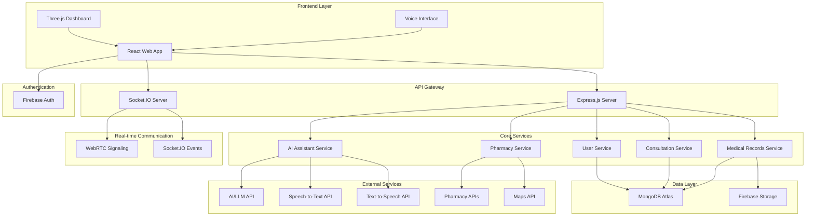

# DoorStepDoctor – Rural Healthcare Access Platform
## Design Document

## Overview

DoorStepDoctor is a full-stack healthcare platform designed to bridge the healthcare access gap in rural India. The system leverages modern web technologies, AI-powered assistance, and low-bandwidth optimization to provide accessible medical consultations, voice-first interactions, and pharmacy integration.

The platform follows a microservices-inspired architecture with clear separation between frontend (React), backend (Node.js/Express), real-time communication (Socket.IO/WebRTC), and external integrations (Firebase Auth, AI services, pharmacy APIs).

## Architecture

### High-Level System Architecture



### Technology Stack

**Frontend:**
- React 18 with TypeScript
- Three.js for 3D health dashboard
- Socket.IO Client for real-time communication
- WebRTC for video/audio calls
- Web Speech API for voice interaction
- Tailwind CSS for responsive design
- React Router for navigation
- Axios for API communication

**Backend:**
- Node.js with Express.js
- TypeScript for type safety
- Socket.IO for real-time events
- WebRTC signaling server
- JWT for session management
- Multer for file uploads
- Compression middleware for low-bandwidth optimization

**Database:**
- MongoDB Atlas for primary data storage
- Firebase Storage for file storage (images, documents)
- Redis for session management and caching

**Authentication:**
- Firebase Authentication
- Custom role-based access control
- OTP verification for phone numbers

**External Integrations:**
- OpenAI/Anthropic API for AI medical assistant
- Google Speech-to-Text API
- Google Text-to-Speech API
- Google Maps API for pharmacy locations
- Mock pharmacy APIs for medicine availability

## Components and Interfaces

### Frontend Component Architecture

```
src/
├── components/
│   ├── auth/
│   │   ├── LoginForm.tsx
│   │   ├── RegisterForm.tsx
│   │   └── OTPVerification.tsx
│   ├── dashboard/
│   │   ├── PatientDashboard.tsx
│   │   ├── DoctorDashboard.tsx
│   │   └── ThreeJSHealthDashboard.tsx
│   ├── consultation/
│   │   ├── ConsultationRoom.tsx
│   │   ├── VideoCall.tsx
│   │   ├── ChatInterface.tsx
│   │   └── ConsultationHistory.tsx
│   ├── medical-records/
│   │   ├── MedicalProfile.tsx
│   │   ├── FileUpload.tsx
│   │   └── PrescriptionViewer.tsx
│   ├── ai-assistant/
│   │   ├── VoiceInterface.tsx
│   │   ├── ChatBot.tsx
│   │   └── LanguageSelector.tsx
│   ├── pharmacy/
│   │   ├── PharmacyFinder.tsx
│   │   ├── MedicineSearch.tsx
│   │   └── OrderTracking.tsx
│   ├── common/
│   │   ├── Header.tsx
│   │   ├── Navigation.tsx
│   │   ├── LoadingSpinner.tsx
│   │   └── ErrorBoundary.tsx
│   └── low-bandwidth/
│       ├── LowBandwidthDetector.tsx
│       └── OptimizedComponents.tsx
├── hooks/
│   ├── useAuth.ts
│   ├── useSocket.ts
│   ├── useWebRTC.ts
│   ├── useVoice.ts
│   └── useBandwidth.ts
├── services/
│   ├── api.ts
│   ├── socket.ts
│   ├── webrtc.ts
│   ├── voice.ts
│   └── storage.ts
├── types/
│   ├── user.ts
│   ├── consultation.ts
│   ├── medical.ts
│   └── pharmacy.ts
└── utils/
    ├── constants.ts
    ├── helpers.ts
    └── validation.ts
```

### Backend API Structure

```
src/
├── controllers/
│   ├── authController.ts
│   ├── userController.ts
│   ├── consultationController.ts
│   ├── medicalRecordsController.ts
│   ├── aiAssistantController.ts
│   └── pharmacyController.ts
├── models/
│   ├── User.ts
│   ├── Consultation.ts
│   ├── MedicalRecord.ts
│   ├── Prescription.ts
│   └── Pharmacy.ts
├── middleware/
│   ├── auth.ts
│   ├── validation.ts
│   ├── rateLimit.ts
│   └── compression.ts
├── routes/
│   ├── auth.ts
│   ├── users.ts
│   ├── consultations.ts
│   ├── medical-records.ts
│   ├── ai-assistant.ts
│   └── pharmacy.ts
├── services/
│   ├── aiService.ts
│   ├── speechService.ts
│   ├── pharmacyService.ts
│   └── notificationService.ts
├── sockets/
│   ├── consultationSocket.ts
│   ├── webrtcSignaling.ts
│   └── aiAssistantSocket.ts
└── utils/
    ├── database.ts
    ├── encryption.ts
    └── logger.ts
```

### Core Interfaces

```typescript
// User Types
interface User {
  id: string;
  email: string;
  phone: string;
  name: string;
  role: 'patient' | 'doctor' | 'admin';
  isVerified: boolean;
  createdAt: Date;
  updatedAt: Date;
}

interface Patient extends User {
  age: number;
  location: {
    latitude: number;
    longitude: number;
    address: string;
  };
  medicalProfile: MedicalProfile;
  languagePreference: string;
  lowBandwidthMode: boolean;
}

interface Doctor extends User {
  medicalLicenseNumber: string;
  specialization: string[];
  location: {
    latitude: number;
    longitude: number;
    address: string;
  };
  availability: {
    isAvailable: boolean;
    workingHours: {
      start: string;
      end: string;
    };
    consultationQueue: string[];
  };
  rating: number;
  consultationsCompleted: number;
}

// Medical Records
interface MedicalProfile {
  patientId: string;
  medicalHistory: string[];
  currentMedications: Medication[];
  allergies: string[];
  documents: MedicalDocument[];
  healthMetrics: HealthMetric[];
  privacySettings: {
    hideFromDoctors: string[];
  };
}

interface MedicalDocument {
  id: string;
  type: 'prescription' | 'report' | 'image';
  fileName: string;
  fileUrl: string;
  uploadDate: Date;
  metadata: {
    reportType?: string;
    doctorName?: string;
    notes?: string;
  };
}

interface HealthMetric {
  id: string;
  type: 'blood_pressure' | 'heart_rate' | 'weight' | 'temperature';
  value: number | { systolic: number; diastolic: number };
  unit: string;
  timestamp: Date;
  source: 'manual' | 'device' | 'doctor';
}

// Consultation
interface Consultation {
  id: string;
  patientId: string;
  doctorId: string;
  status: 'requested' | 'accepted' | 'in_progress' | 'completed' | 'cancelled';
  type: 'chat' | 'voice' | 'video';
  startTime: Date;
  endTime?: Date;
  duration?: number;
  messages: ConsultationMessage[];
  prescription?: Prescription;
  notes: string;
  rating?: {
    patientRating: number;
    doctorRating: number;
    feedback: string;
  };
}

interface ConsultationMessage {
  id: string;
  senderId: string;
  senderRole: 'patient' | 'doctor';
  content: string;
  type: 'text' | 'image' | 'file';
  timestamp: Date;
  isTranslated?: boolean;
  originalLanguage?: string;
}

// AI Assistant
interface AIConversation {
  id: string;
  patientId: string;
  messages: AIMessage[];
  language: string;
  context: {
    medicalHistory: string[];
    currentSymptoms: string[];
    urgencyLevel: 'low' | 'medium' | 'high' | 'emergency';
  };
  createdAt: Date;
  updatedAt: Date;
}

interface AIMessage {
  id: string;
  role: 'user' | 'assistant';
  content: string;
  audioUrl?: string;
  timestamp: Date;
  confidence?: number;
}

// Pharmacy
interface Pharmacy {
  id: string;
  name: string;
  address: string;
  location: {
    latitude: number;
    longitude: number;
  };
  phone: string;
  workingHours: {
    open: string;
    close: string;
  };
  inventory: MedicineInventory[];
  rating: number;
  isVerified: boolean;
}

interface MedicineInventory {
  medicineId: string;
  name: string;
  genericName: string;
  manufacturer: string;
  price: number;
  quantity: number;
  expiryDate: Date;
  isAvailable: boolean;
}

interface MedicineOrder {
  id: string;
  patientId: string;
  pharmacyId: string;
  prescriptionId: string;
  medicines: {
    medicineId: string;
    quantity: number;
    price: number;
  }[];
  totalAmount: number;
  status: 'placed' | 'confirmed' | 'prepared' | 'delivered' | 'cancelled';
  orderDate: Date;
  estimatedDelivery?: Date;
}
```

## Data Models

### MongoDB Schema Design

```javascript
// Users Collection
const userSchema = {
  _id: ObjectId,
  email: String, // indexed, unique
  phone: String, // indexed, unique
  name: String,
  role: String, // enum: ['patient', 'doctor', 'admin']
  isVerified: Boolean,
  firebaseUid: String, // indexed, unique
  
  // Patient-specific fields
  age: Number,
  location: {
    type: "Point",
    coordinates: [Number, Number] // [longitude, latitude]
  },
  languagePreference: String,
  lowBandwidthMode: Boolean,
  
  // Doctor-specific fields
  medicalLicenseNumber: String,
  specialization: [String],
  availability: {
    isAvailable: Boolean,
    workingHours: {
      start: String,
      end: String
    },
    consultationQueue: [ObjectId]
  },
  rating: Number,
  consultationsCompleted: Number,
  
  createdAt: Date,
  updatedAt: Date
};

// Medical Profiles Collection
const medicalProfileSchema = {
  _id: ObjectId,
  patientId: ObjectId, // indexed
  medicalHistory: [String],
  currentMedications: [{
    name: String,
    dosage: String,
    frequency: String,
    startDate: Date,
    endDate: Date
  }],
  allergies: [String],
  documents: [{
    id: String,
    type: String, // enum: ['prescription', 'report', 'image']
    fileName: String,
    fileUrl: String,
    uploadDate: Date,
    metadata: {
      reportType: String,
      doctorName: String,
      notes: String
    }
  }],
  healthMetrics: [{
    type: String,
    value: Schema.Types.Mixed,
    unit: String,
    timestamp: Date,
    source: String
  }],
  privacySettings: {
    hideFromDoctors: [String]
  },
  createdAt: Date,
  updatedAt: Date
};

// Consultations Collection
const consultationSchema = {
  _id: ObjectId,
  patientId: ObjectId, // indexed
  doctorId: ObjectId, // indexed
  status: String, // enum: ['requested', 'accepted', 'in_progress', 'completed', 'cancelled']
  type: String, // enum: ['chat', 'voice', 'video']
  startTime: Date, // indexed
  endTime: Date,
  duration: Number,
  messages: [{
    id: String,
    senderId: ObjectId,
    senderRole: String,
    content: String,
    type: String,
    timestamp: Date,
    isTranslated: Boolean,
    originalLanguage: String
  }],
  prescription: {
    medicines: [{
      name: String,
      genericName: String,
      dosage: String,
      frequency: String,
      duration: String,
      instructions: String
    }],
    notes: String,
    issuedAt: Date
  },
  notes: String,
  rating: {
    patientRating: Number,
    doctorRating: Number,
    feedback: String
  },
  createdAt: Date,
  updatedAt: Date
};

// AI Conversations Collection
const aiConversationSchema = {
  _id: ObjectId,
  patientId: ObjectId, // indexed
  messages: [{
    id: String,
    role: String, // enum: ['user', 'assistant']
    content: String,
    audioUrl: String,
    timestamp: Date,
    confidence: Number
  }],
  language: String,
  context: {
    medicalHistory: [String],
    currentSymptoms: [String],
    urgencyLevel: String // enum: ['low', 'medium', 'high', 'emergency']
  },
  createdAt: Date,
  updatedAt: Date
};

// Pharmacies Collection
const pharmacySchema = {
  _id: ObjectId,
  name: String,
  address: String,
  location: {
    type: "Point",
    coordinates: [Number, Number] // [longitude, latitude]
  },
  phone: String,
  workingHours: {
    open: String,
    close: String
  },
  inventory: [{
    medicineId: String,
    name: String,
    genericName: String,
    manufacturer: String,
    price: Number,
    quantity: Number,
    expiryDate: Date,
    isAvailable: Boolean
  }],
  rating: Number,
  isVerified: Boolean,
  createdAt: Date,
  updatedAt: Date
};

// Medicine Orders Collection
const medicineOrderSchema = {
  _id: ObjectId,
  patientId: ObjectId, // indexed
  pharmacyId: ObjectId, // indexed
  prescriptionId: ObjectId,
  medicines: [{
    medicineId: String,
    quantity: Number,
    price: Number
  }],
  totalAmount: Number,
  status: String, // enum: ['placed', 'confirmed', 'prepared', 'delivered', 'cancelled']
  orderDate: Date, // indexed
  estimatedDelivery: Date,
  createdAt: Date,
  updatedAt: Date
};
```

### Database Indexes

```javascript
// Performance optimization indexes
db.users.createIndex({ "email": 1 }, { unique: true });
db.users.createIndex({ "phone": 1 }, { unique: true });
db.users.createIndex({ "firebaseUid": 1 }, { unique: true });
db.users.createIndex({ "role": 1 });
db.users.createIndex({ "location": "2dsphere" });

db.medicalProfiles.createIndex({ "patientId": 1 }, { unique: true });

db.consultations.createIndex({ "patientId": 1 });
db.consultations.createIndex({ "doctorId": 1 });
db.consultations.createIndex({ "startTime": -1 });
db.consultations.createIndex({ "status": 1 });

db.aiConversations.createIndex({ "patientId": 1 });
db.aiConversations.createIndex({ "createdAt": -1 });

db.pharmacies.createIndex({ "location": "2dsphere" });
db.pharmacies.createIndex({ "isVerified": 1 });

db.medicineOrders.createIndex({ "patientId": 1 });
db.medicineOrders.createIndex({ "pharmacyId": 1 });
db.medicineOrders.createIndex({ "orderDate": -1 });
```
